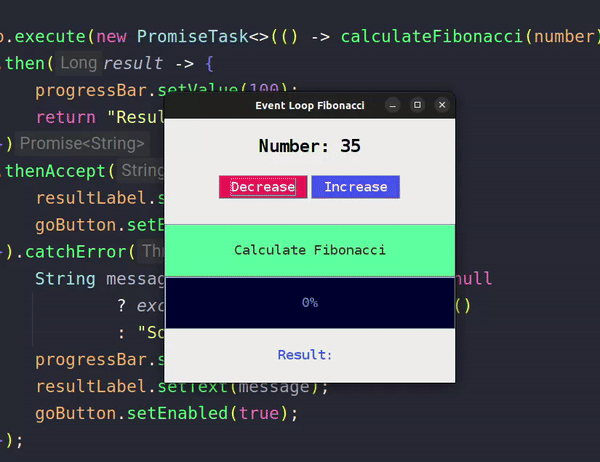

# Event Loop

| Members                     |
| :-------------------------- |
| Luiggy Mamani Condori       |
| Axel Ayala Siles            |
| Salet Yasmin Gutierrez Nava |

---

# Event Loop Integration Script Documentation

The script automates the process of compiling a Java project, creating a JAR file, and copying it to the **Client** project, which uses Gradle. Once the JAR is copied, the script will trigger a Gradle build in the **Client** project to verify the integration. The update to the **Client** project's `build.gradle` to include the JAR as a dependency must be done manually.

## Running the Script

1. Ensure the script has the permissions for execution:
    ```bash
    chmod +x integrate_event_loop.sh
    ```
2. To execute the script, run the following command:
    ```bash
    ./integrate_event_loop.sh
    ```

**Expected output**

```bash
➜ ./integrate_event_loop.sh
12/07/24 09:43:37 | COMPILING EVENT LOOP...
12/07/24 09:43:38 | CREATING EVENT LOOP JAR...
Process logs...
12/07/24 09:43:39 | ADDING EVENT LOOP JAR TO THE CLIENT...
12/07/24 09:43:39 | BUILDING CLIENT WITH GRADLE...
Process logs...
12/07/24 09:43:47 | INTEGRATION COMPLETED SUCCESSFULLY
```

# Examples

## Fibonacci
In this example we will use the event loop to handle the creation of the UI and the change of the incrementing and decrementing number input `as Immediate tasks that will go to the Call Stack`, and the Fibonacci calculation will be `handled as a promise` as an input and output operation, where the number will be the input and the `result will be the output that will be handled with callbacks` to display it in the UI.

**As seen in the example, the increment operations (Call Stack Tasks) are not interrupted while the Fibonacci calculation is being done (Promise that will be sent to the MicroTask Queue).**
